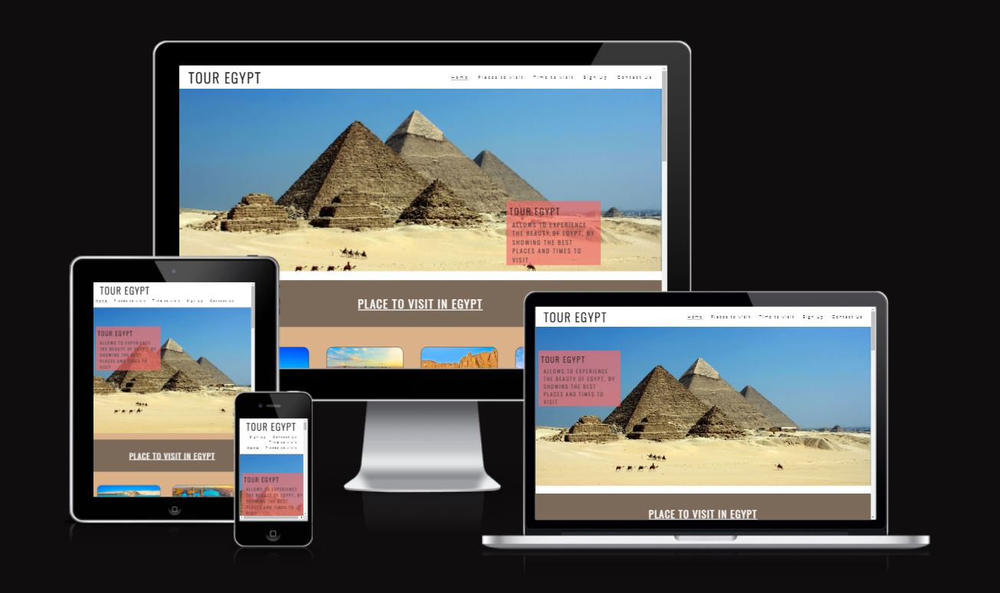
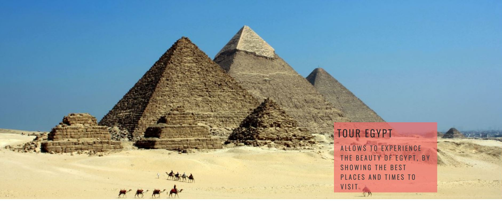
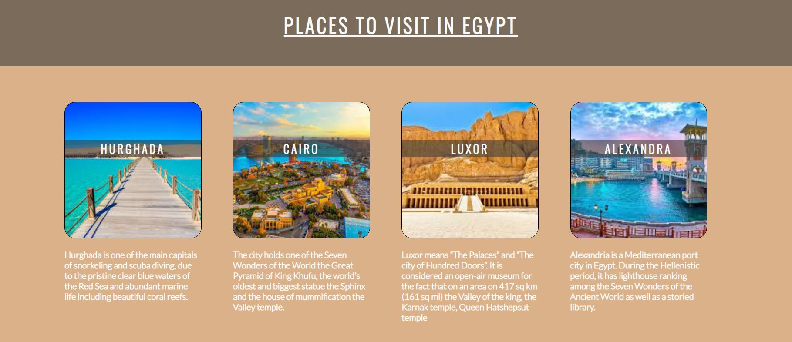
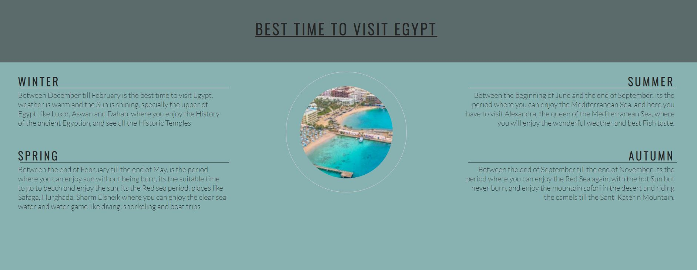
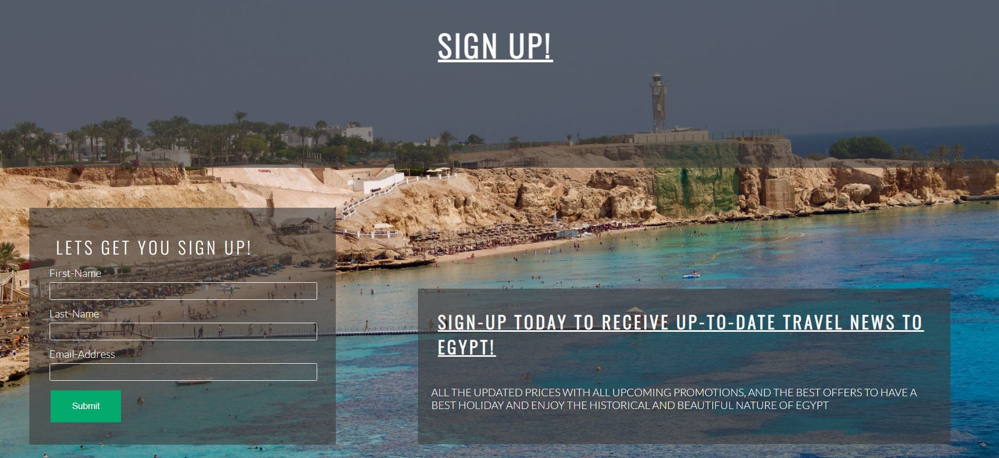
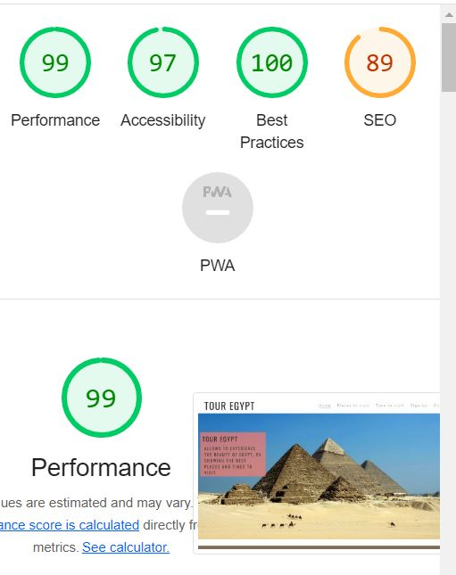

# Tour Egypt

Tour-Egypt is a site that take you in tour allover Egypt, to give you an idea of the places that you can visite and the best times to visite Egypt, if you have the intension to travel to Egypt.
Egypt is one of the historic country, it contain alot of history from the edge of phero till the modern Egypt.
Visiting Egypt will help you understand history with a whole view of different historic periods and let you see how acient history was created.
Egypt has one of the best beaches in the world (Mediterranean Sea & Red sea), where you can enjoy all the sea sports from diving snorkling, sea trips, water games, the weather is sunny alomst the whole year and you have different options of places to enjoy the sun.

# Features

## Navigation

- Featured at the top of the page, that navigation shows the site name in the left corner: Tour Egypt that links to the top of the page.
- The other navigation links are to the right, which link to different sections of the same page. 
- The navigation clearly tells the user the name of the site and makes the different section of information easy to find. 

# The landing page image

The landing includes a photograph with text overlay to allow the user to see exactly which location this site would be applicable to.
This section introduces the user to Tour Egypt with an eye catching animation to grab their attention showing the Great Pyramids of GIZA.

# Places to visit Section

The Places to visit section will allow the user to see the varity of location they can visit when they are in Egypt, giving them a small view of the beauty of each location and what specialize that location. 
This user will see the value of varity to have in one place, This should encourage the user to consider going not just for the weather and beautiful beaches but also for the history that spread in every location you are in Egypt.

# Best time to visit section

This section will allow the user to see exactly when they can decide to travel and best timing according to their need, it gives a full description of the weather and places suitable for this time of the year.
This section will be updated as these times change to keep the user up to date.

# The Footer

The footer section includes links to the relevant social media sites for Tour Egypt. The links will open to a new tab to allow easy navigation for the user.
The footer is valuable to the user as it encourages them to keep connected via social and also by Phone or email address to have fast response on any query.

# The Sign Up Page

This page will allow the user to get signed up to Tour Egypt to start their journey to Egypt. The user will be able specify if they would like to take part in in the winter or summer trips and the available location to visite in this time of year. The user will be asked to submit their full name and email address.

# Testing

- I tested that this page works indifferent browser: Chrome, FireFox, Safari.
- I confirmed that this project is responsive, look good and functions on all standard screen sizes using the ami.responsivedesign.is
- I conformed that the navigation, header, sign up and contact us text are all readable and easy to understand.
- I have confirmed that the form works: requires entries in every field, will only accept an email in the email field, and the submit button works. 

## Bugs

### Solve bugs
- When i deployed my project to GitHub Pages i discovered the main image is not showing, the size of the image wasnot the right one.
- I decided this because, i tried to use different images with different sizes and i always had the same error.
- I kept trying till i found the suitable image that fits /suits my page.
- I adjusted the image /fixed the problem.

# Validator 

## HTML
No errors were returned when passing through the official W3C validator
## CSS
No errors were found when passing through the official (Jigsaw) validator
## Accessibility 
I confirm that the color and fonts chossen are easy to read and accessible by running it through lighthouse in 

# Unfixed Bugs

While deploment of the project, alot of bugs shown up, that required alot of fixing and adjusting the code.but none of the bugs where left unfixed, most of bugs are dealt with, and got fixed. alot of technologies have been used in this site like media query section, animation that gives alot of nice effects to the site.

# Deployment

The site was deployed to GitHub pages. The steps to deploy are as follows:
In the GitHub repository, navigate to the Settings tab
From the source section drop-down menu, select the Master Branch
Once the master branch has been selected, the page will be automatically refreshed with a detailed ribbon display to indicate the successful deployment.
The live link can be found here - https://melhefnawi.github.io/Tour-Egypt/

# Credits

## Content

The text for the Home page was taken from CI LOVE RUNNING Project.
Instructions on how to implement form validation on the Sign Up page was taken from CI Love Running Project.
Some of the code names, ids, classes,animation and media query was taken from the CI Love Running Project.
The icons in the footer were taken from Font Awesome.

## Media

The photos used on the home and sign up page are from This Open Source site
The images used for the gallery page were taken from this other open source site.