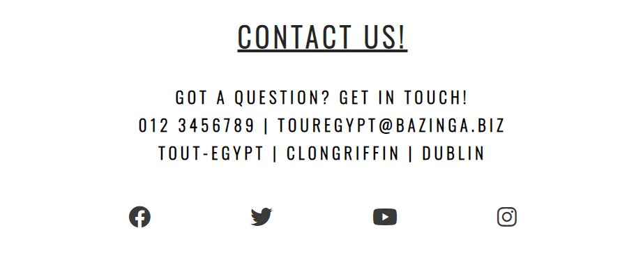

# Tour Egypt

Tour-Egypt is a site that takes users in tour allover Egypt. The page gives an idea of the best places to visit and the best times to visit Egypt.
Egypt is one of the most history filled countries: from the ancient world of pharos to the most modern Egypt.
Visiting Egypt will help understand history with a whole view of different historic periods and give a glimpse into the creation of the ancient history.
Egypt has some of the best beaches in the world (Mediterranean Sea and Red sea), where you can enjoy all the sea sports from diving, snorkling, sea trips, water games. The weather is sunny alomst the whole year around and you have different options of places to enjoy the sun.

# Features

## Navigation

- Featured at the top of the page, that navigation bar shows the site name in the left corner: 'Tour Egypt' that links to the top of the page.
- The other navigation links are to the right, linked to different sections of the page. 
- The navigation bar clearly tells the user the name of the site and makes the different sections of information easy to find. 

# The landing page image

The landing includes a photograph with text overlay to allow the user to see exactly which location this site would be applicable to.
This section introduces the user to Tour Egypt with an eye catching animation to grab their attention showing the Great Pyramids of Giza.

# Places to visit Section

The Places to visit section will allow the user to see the variety of locations they can visit when they are in Egypt, giving them a small view of the beauty of each location and what makes special that location. Users will see the value of variety to have in one place. This should encourage the user to consider going not just for the weather and beautiful beaches but also for the history that spreads in every location in Egypt.

# Best time to visit section

This section will allow the user to see exactly when they can decide to travel and best timing according to their needs. It gives a full description of the weather and places suitable for each time of the year.
This section will be updated as these times change to keep the user up to date.

# The Footer

The footer section includes links to the relevant social media sites for Tour Egypt. The links will open to a new tab to allow easy navigation for the user.
The footer is valuable to the user as it encourages them to keep connected via social and also by Phone or email address, to have fast responses on any query.

# The Sign Up Page

This section allows the user to get signed up to Tour Egypt, to start their journey to Egypt. The user will be able to specify if they would like to take part in the winter or summer trips and the available locations in each time of the year. The user will be asked to submit their full name and email address. All form fields are required and when pressing the submit button the empty fields will be highlighted by notification of requirement.

# Testing

- I tested that this page works indifferent browser: Chrome, FireFox, Safari.
- I confirmed that this project is responsive, looks good and functions on all standard screen sizes using the ami.responsivedesign.is
- I conformed that the navigation, header, sign up and contact us text are all readable and easy to understand.
- I have confirmed that the form works: requires entries in every field, will only accept an email in the email field, and the submit button works. 

## Bugs

### Solve bugs
- When I deployed my project to GitHub Pages I discovered the main image is not showing, the size of the image was not the right one.
- I decided to change the image because, I tried to use different images with different sizes and I always had the same error.
- I kept trying until I found the suitable image that fits /suits my page.
- I adjusted the image and fixed the problem.

# Validator 

## HTML
No errors were returned when passing through the official W3C validator
## CSS
No errors were found when passing through the official (Jigsaw) validator
## Accessibility 
I confirm that the color and fonts chossen are easy to read and accessible by running it through lighthouse in 

# Unfixed Bugs

While deploying the project, a lot of bugs showed up, that required a lot of fixing and adjusting to the code. None of the bugs where left unfixed. A multitude of technologies have been used on this site like media query section, animation that gives nice effects to the site.

# Deployment

The site was deployed to GitHub pages. The steps to deploy are as follows:
In the GitHub repository, navigate to the Settings tab
From the source section drop-down menu, select the Master Branch
Once the master branch has been selected, the page will be automatically refreshed with a detailed ribbon display to indicate the successful deployment.
The live link can be found here - https://melhefnawi.github.io/Tour-Egypt/

# Credits

## Content

The text for the Home page was taken from CI LOVE RUNNING Project.
Instructions on how to implement form validation on the Sign Up page was taken from CI Love Running Project.
Some of the code names, ids, classes,animation and media query was taken from the CI Love Running Project.
The icons in the footer were taken from Font Awesome.

## Media

The photos used on the home and sign up page are from pexels.com
The images used for the gallery page were taken from pexels.com